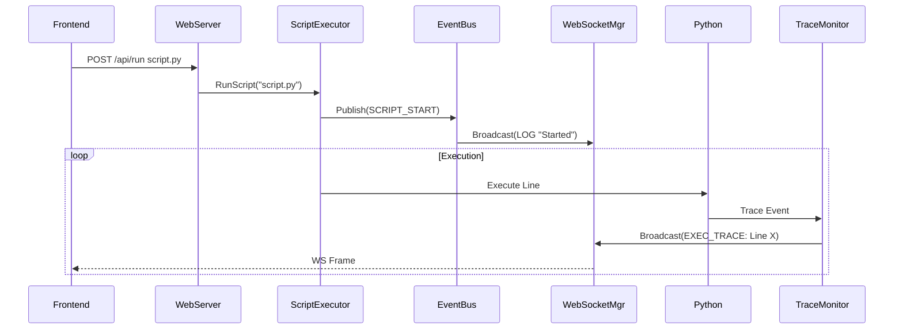

# Backend Architecture Design
Version: 1.0

## 1. Directory Structure
```
src/
  amr/
    Server/       # New Network Layer
      WebServer.cpp      # HTTP Handlers
      WebSocketMgr.cpp   # WS Session Management
      Protocol.hpp       # Packet Definitions
    Scripting/    # Python Integration
      ScriptExecutor.cpp
      TraceMonitor.cpp   # Python Trace Hook (Line-by-line)
    Core/         # Business Logic
      AppModel.cpp
      Hardware.cpp
```

## 2. Class Design

### 2.1 WebSocketManager
Manages active WS connections and broadcasting.
- `Broadcast(json data)`: Send to all.
- `SendTo(id, json data)`: Send to specific client.
- Uses `std::mutex` to protect connection list.

### 2.2 TraceMonitor (Extension to ScriptExecutor)
A C++ class that binds to `sys.settrace`.
- **OnLine(frame)**: 
  1. Extracts Line Number, Filename.
  2. Packages into `EXEC_TRACE` JSON.
  3. Pushes to `EventBus` -> `WebSocketManager`.

### 2.3 SimHardware (Enhanced)
Decoupled from ImGui.
- **Update(dt)**: Runs physics simulation.
- **Snapshot()**: Returns a struct of all Axes/IO states for Telemetry.

## 3. Data Flow
1. **Simulation Loop (100Hz)**
   - `PhysicsContext::Update()` -> Moves Virtual Robot.
   - `SimHardware::Update()` -> Syncs Physics to Axis Registers.
   - `WebSocketMgr::Broadcast( Telemetry )`.

2. **Script Execution**
   - User `POST /api/run`.
   - `ScriptExecutor` spawns thread.
   - Python executes line 10.
   - `TraceMonitor` fires.
   - `WebSocketMgr::Broadcast( EXEC_TRACE )`.
   - Frontend highlights Node corresponding to Line 10.

## 4. Signal Flow Diagram

