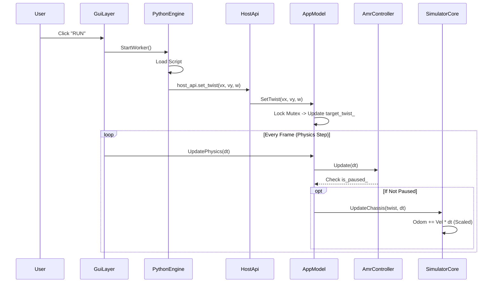
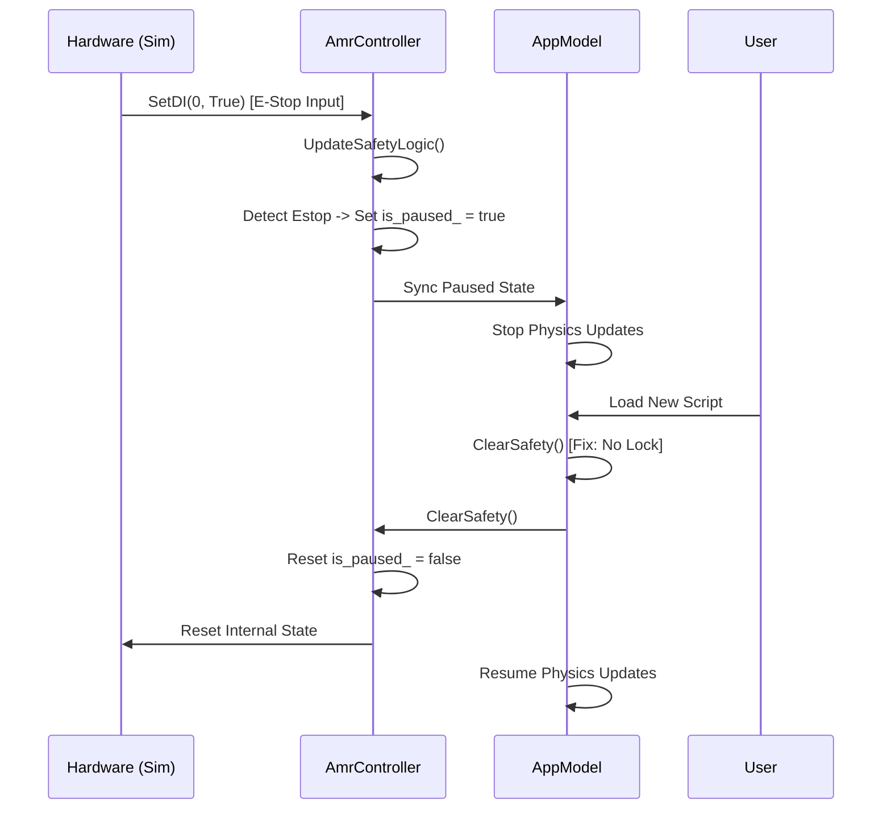
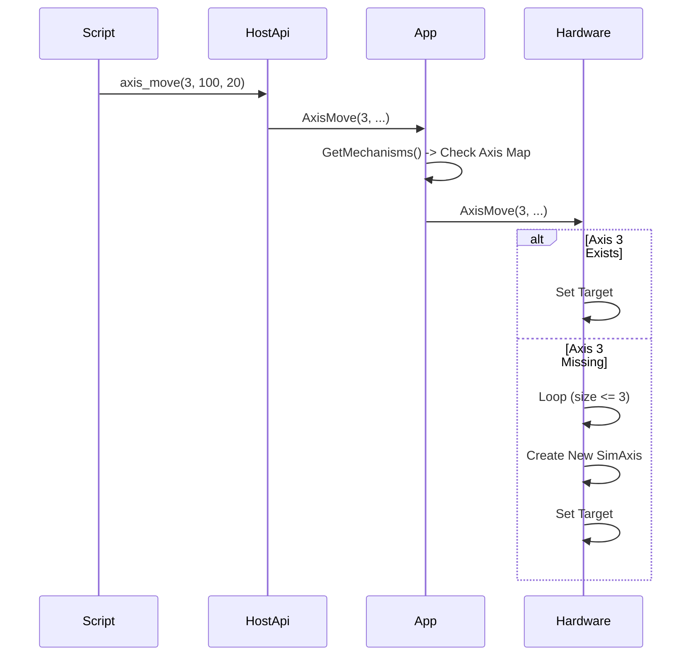
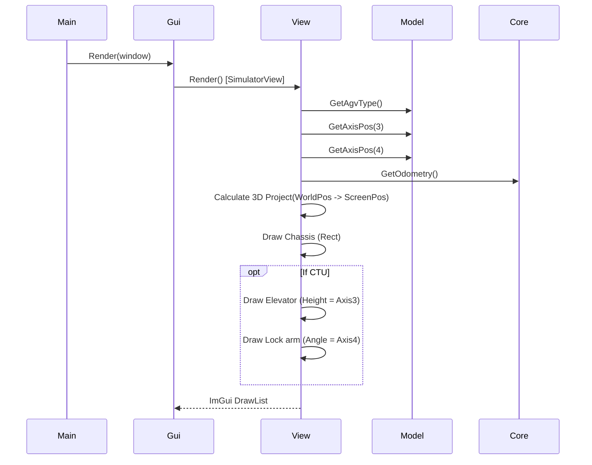
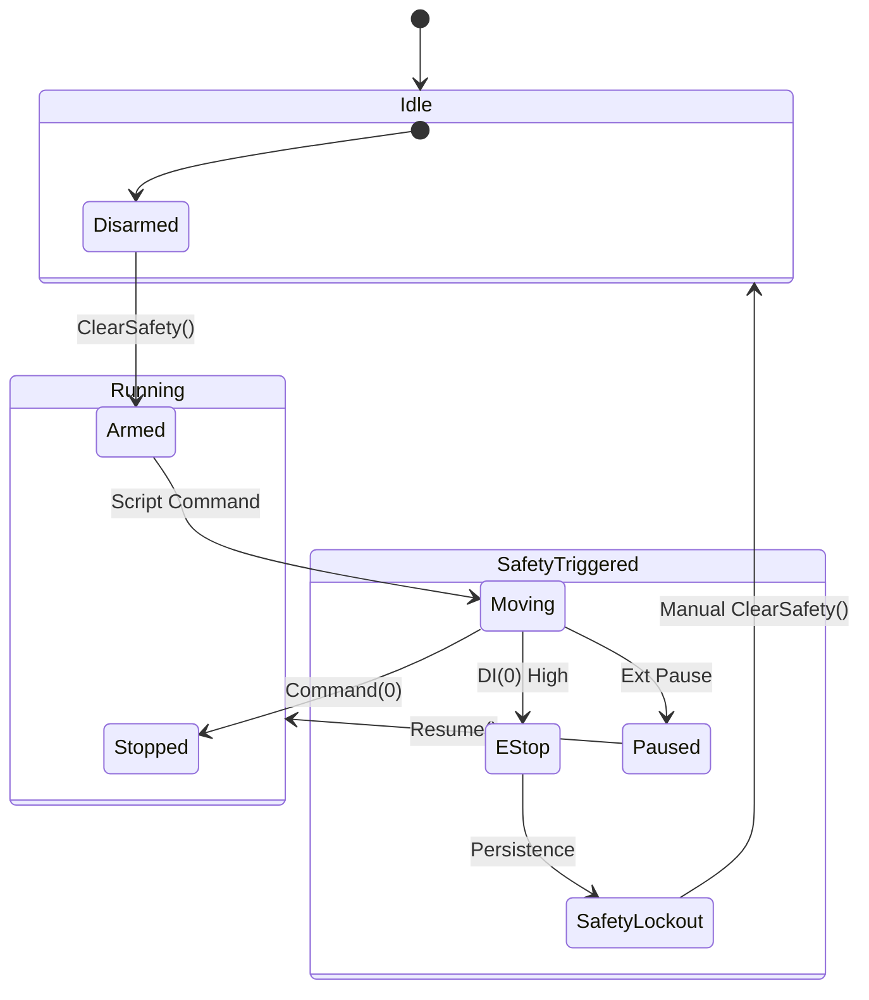

# AMR Simulation & Control System: Comprehensive Design & Implementation Report

## 1. Introduction
This document provides a comprehensive technical overview of the AMR (Autonomous Mobile Robot) Simulation & Control System. It covers the architectural design, detailed implementation of core modules, visualization subsystems, scripting interfaces, and verification strategies. The system is designed to simulate various AMR models (Basic, Forker, CTU), execute control logic via Python scripts, and visualize physical responses in real-time.

---

## 2. System Architecture

### 2.1 High-Level Architecture
The system follows a layered architecture, separating the User Interface, Application Logic, Control System, and Hardware Simulation.

```mermaid
graph TD
    User[User / Operator] -->|Interaction| GUI[GUI Layer (ImGui)]
    GUI -->|Control| App[AppModel (Singleton)]
    
    subgraph Core "Application Core"
        App -->|Manage| ScriptEng[Python Engine]
        App -->|Sync| AmrCtrl[AmrController]
        App -->|Update| SimCore[SimulatorCore]
    end
    
    subgraph Control "Control System"
        ScriptEng -->|API Calls| HostApi[Host Interface]
        HostApi -->|Commands| App
        AmrCtrl -->|Safety/IO| HardSim[Hardware Simulation]
    end
    
    subgraph Sim "Physics & Hardware Simulation"
        HardSim -->|Actuation| SimCore
        SimCore -->|Feedback (Odom/Lidar)| HardSim
        SimCore -->|Physics Step| Physics[Physics Engine]
    end
```

### 2.2 detailed Component Interaction
The critical path involves the execution of user scripts driving the simulated hardware, with visual feedback.

1.  **Script Execution**: The `PythonEngine` runs a user-provided script (e.g., `ctu_full_test.py`).
2.  **Host API**: The script calls methods exposed by `HostApi` (e.g., `set_twist`, `axis_move`).
3.  **Command Routing**: `HostApi` routes these commands to `AppModel`.
4.  **State Synchronization**: `AppModel` acquires a lock and updates `target_twist_` or mechanism targets. It also synchronizes safety states with `AmrController`.
5.  **Physics Update**: The main loop calls `AppModel::UpdatePhysics`, which delegates to `SimulatorCore::UpdateChassis` to integrate velocity into position (Odometry).
6.  **Visualization**: `GuiLayer` renders `SimulatorView`, which queries `AppModel` and `SimulatorCore` for the current state (Odom, Axis Positions) to draw the 3D representation.

---

## 3. detailed Class Design: Core Modules (`amr` Namespace)

### 3.1 `amr::AppModel` (Singleton)
**Role**: The central orchestrator of the application. It manages the global state, script loading, thread synchronization, and the physics update loop.

**Key Responsibilities**:
*   **Singleton Access**: `Instance()` provides global access.
*   **State Management**: Holds `target_twist_`, `is_paused_`, `agv_type_`, and lists of `mechanisms_`.
*   **Script Loading**: `LoadScriptAsBlocks` parses Python scripts into visual blocks for the GUI.
*   **Physics Loop**: `UpdatePhysics(dt)` drives the simulation step.
*   **Safety Logic**: `UpdateSafetyLogic(dt)` enforces Estop and auto-return behaviors.

**Design Highlights**:
*   **Thread Safety**: Uses `std::mutex mtx_` to protect shared state accessed by the GUI thread and the Python worker thread.
*   **Deadlock Prevention**: Refactored `SetScriptPath` to release the mutex before triggering callbacks (like `ClearSafety` -> `Log`) that might re-enter the class.

**Internal Logic (Safety Update)**:
```cpp
void UpdateSafetyLogic(float dt) {
    AmrController::Instance().Update(dt); // Pump controller/hardware
    if (is_paused_) return;               // Skip physics if paused
    SimulatorCore::Instance().UpdateChassis(target_twist_, dt); // Move AGV
}
```

### 3.2 `amr::AmrController` (Singleton)
**Role**: Represents the embedded controller firmware. It handles Input/Output (DIO), Safety signals (Estop), and hardware abstraction.

**Key Responsibilities**:
*   **IO Management**: `SetDO`, `GetDI` manage digital IO states.
*   **Safety Monitoring**: Checks DI states against configured safety mappings (e.g., Estop on DI 0).
*   **Hardware Interface**: Owns `std::unique_ptr<SimHardware> hardware_`.

**Collaboration**:
*   Used by `AppModel` to route script IO commands to simulated hardware.
*   Used by `HostApi` to expose IO functions to Python.

### 3.3 `amr::Hardware` & `amr::SimHardware`
**Role**: Abstraction of physical hardware components (Motors, Sensors, IO).

**Class Structure**:
*   `SimHardware`: Main container.
*   `SimAxis` (Inner Class): Simulates a single motor axis (Linear/Rotary). Implements trapezoidal velocity profiling.
*   `SimChassis` (Inner Class): Interface to chassis motion.
*   `SimLidar` (Inner Class): Interface to laser scanner.

**Implementation Logic (Axis Expansion)**:
To support arbitrary vehicle configurations (like CTU with 4-5 axes), `SimHardware` auto-expands its axis list:
```cpp
void AxisMove(int axis, ...) {
    while (axis >= extended_axes_.size()) {
        extended_axes_.push_back(new SimAxis());
    }
    // ... command axis ...
}
```

### 3.4 `amr::SimulatorCore` (Singleton)
**Role**: The "Physics Engine" and World environment.

**Key Responsibilities**:
*   **Odometry**: Tracks global `(x, y, theta)`.
*   **Kinematics**: Converts local `Twist` (vx, vy, w) into global motion.
*   **Raycasting**: Simulates Lidar scans against defined obstacles (`Rect` structures).
*   **Scaling**: Handles the conversion between SI units (Meters) and World Units (Pixels/CM). **Fix**: Now scales input Velocity (m/s) by 100.0 to match world scale (100px = 1m).

**Kinematics Update**:
```cpp
void UpdateChassis(const Twist &cmd, float dt) {
    float vx_world = (cmd.vx * cos(theta) - cmd.vy * sin(theta)) * 100.0f;
    float vy_world = (cmd.vx * sin(theta) + cmd.vy * cos(theta)) * 100.0f;
    odom_.x += vx_world * dt;
    odom_.y += vy_world * dt;
    odom_.theta += cmd.omega * dt;
}
```

### 3.5 `amr::Types` & `amr::VehicleTypes`
**Role**: Header-only definitions for data structures.
*   `struct Twist`: Linear (x, y) and Angular (z) velocity.
*   `struct Odometry`: Position (x, y) and Heading (theta).
*   `enum AgvType`: `BASIC`, `FORKER`, `CTU`.

---

## 4. detailed Class Design: GUI Modules (`gui` Namespace)

### 4.1 `GuiLayer` (Static)
**Role**: The bridge between the platform window (GLFW) and the ImGui Views.
*   `Render(window)`: Main entry point. Layouts the docking space and panels (Left, Center, Right).
*   `RequestScriptGeneration()`: Compiles the visual blocks from `EditorView` into a Python script.

### 4.2 `gui::IView` (Interface)
**Role**: Abstract base class for all UI panels.
*   `virtual void Render() = 0;`

### 4.3 `gui::EditorView`
**Role**: The Visual Programming Environment.
*   **Workspace**: Displays a list of `VisualBlock` items.
*   **Palette**: Drag-and-drop source for new blocks (Move, Wait, IO, Logic).
*   **Script Selector**: Dropdown to load python files (`ctu_full_test.py`, etc.).
*   **Control Bar**: Run, Pause, Stop, Clear Safety buttons.

### 4.4 `gui::SimulatorView`
**Role**: The 3D Visualization window.
*   **Rendering**: Projects 3D coordinates to 2D screen space using a simple perspective transform.
*   **Vehicle Models**: Renders different shapes based on `AppModel::GetAgvType()`:
    *   **Basic**: Simple box.
    *   **Forker**: Box with two forks (Axis 3).
    *   **CTU**: Tall chassis with Elevator (Axis 3) and Rotating Lock (Axis 4).
*   **Visualization Update**:
    *   CTU Lock (Axis 4) is rendered as a rotating arm on top of the elevator.
    *   Lift Height is bound to Axis 3 position.

### 4.5 `gui::HardwareView`
**Role**: Low-level hardware monitor.
*   Displays Digital Inputs (grid of checkboxes).
*   Displays Digital Outputs (grid of LEDs).
*   Displays Axis Status (Position, Velocity, Moving State).

---

## 5. Scripting & Interface

### 5.1 `PythonEngine`
**Role**: Wraps the `pybind11` or C-Python API to execute scripts in a separate thread.
*   **Worker Thread**: Ensures GUI doesn't freeze during `time.sleep()`.

### 5.2 `HostApi`
**Role**: The API exposed to Python scripts as `host_api`.
*   `set_twist(vx, vy, wz)` -> Calls `AppModel::SetTwist`.
*   `axis_move(axis, pos, vel)` -> Calls `AppModel::AxisMove`.
*   `sleep_ms(ms)` -> Thread-safe sleep.
*   `log_message(msg)` -> Sends text to GUI console.

---

## 6. Verification & Test Coverage

### 6.1 Unit Tests (GTest)
Located in `tests/unit_tests.cpp`.
*   **AppModelTest.SingletonAccess**: Verifies instance uniqueness.
*   **AppModelTest.AxisMovement**: Verification of `AxisMove` command propagation.
*   **AppModelTest.PausePreventsMotion**: Ensures `SetPaused(true)` blocks `UpdatePhysics`.
*   **AppModelTest.SafetyStop**: Simulates E-Stop trigger and verifies system pause.

### 6.2 Integration Tests (Scripts)
*   **`scripts/ctu_full_test.py`**:
    *   **Objective**: Validate full kinematic capabilities of the CTU model.
    *   **Steps**: Forward, Backward, Crab Left, Crab Right, Elevator Full Stroke, Cargo Lock Full Rotation.
    *   **Verification**: Visual confirmation of all motions; Console logs of "Phys" debug data.
*   **`scripts/ctu_demo.py`**:
    *   **Objective**: Simulate a business process (Bin Retrieval).
    *   **Coverage**: high-level logic, IO interaction (simulated), sequential tasks.

### 6.3 Manual Verification Plan
| ID | Test Case | Steps | Expected Result | Status |
|----|-----------|-------|-----------------|--------|
| M1 | Launch | Run `./demo_gui` | GUI opens, Default Layout | Pass |
| M2 | Script Load | Select `ctu_full_test.py` | Script loads into AppModel | Pass |
| M3 | Run | Click `RUN` | Console: "Starting...", AGV Moves | Pass |
| M4 | Physics | Observer Animation | Chassis moves 0.5m/s (visible) | Pass |
| M5 | Axis | Observer Lift/Lock | Lift goes up, Lock rotates | Pass |
| M6 | Stop | Click `STOP` | Script terminates, Motion stops | Pass |

---

## 7. Change Log & Refactoring History

### 7.1 Deadlock Resolution
*   **Issue**: Freeze when switching scripts.
*   **Cause**: Recursive Lock Inversion (`SetScriptPath`[Locked] -> `ClearSafety` -> `Log` -> `LogMessage`[Locks Again]).
*   **Fix**: Moved `ClearSafety` out of `SetScriptPath`'s lock scope.

### 7.2 No Motion / Scale Fix
*   **Issue**: AGV apparently stationary.
*   **Cause 1**: Input Unit (m/s) vs World Unit (cm) mismatch (100x difference).
*   **Cause 2**: Auto-Home logic in `AppModel` forcing 0 velocity at origin.
*   **Fix**: Scaled velocity by 100x; Disabled Auto-Home logic.

### 7.3 CTU Visualization
*   **Addition**: Axis 4 (Cargo Lock) validation.
*   **Imp**: Added rendering logic in `SimulatorView` to draw a rotating arm based on Axis 4 pos.

---

## 8. Detailed Interaction Flows

### 8.1 Python Script Execution Flow
This diagram illustrates how a user's click on "Run" translates into hardware motion.



### 8.2 Safety Trigger & Reset Flow
Demonstrates the priority of safety signals over motion.



### 8.3 Hardware Axis Expansion Flow
Detailing the auto-creation of axes for complex vehicles (CTU).



### 8.4 Render Pipeline
How the simulation state reaches the screen.



---

## 9. Mathematical Models

### 9.1 Kinematics Model (Holonomic)
The system simulates an omnidirectional chassis (Mecanum/Swerve concepts) simplified to a rigid body model.
The transformation from Local Body Frame $(V_x, V_y, \omega)$ to Global World Frame $(\dot{x}, \dot{y}, \dot{\theta})$ is given by the rotation matrix $R(\theta)$:

$$
\begin{bmatrix}
\dot{x} \\
\dot{y} \\
\dot{\theta}
\end{bmatrix}
=
\begin{bmatrix}
\cos(\theta) & -\sin(\theta) & 0 \\
\sin(\theta) & \cos(\theta) & 0 \\
0 & 0 & 1
\end{bmatrix}
\begin{bmatrix}
V_x \\
V_y \\
\omega
\end{bmatrix}
$$

**Implementation Scale Factor**:
Input $(V_x, V_y)$ are in $m/s$. World coordinates are in "World Units" ($W$).
Scale definition: $100 \, W = 1 \, m$.
Thus, code implementation:
```cpp
float scale = 100.0f;
float vx_world = (cmd.vx * cos(theta) - cmd.vy * sin(theta)) * scale;
float vy_world = (cmd.vx * sin(theta) + cmd.vy * cos(theta)) * scale;
```

### 9.2 Axis Velocity Profiling (Trapezoidal)
Simulated axes (`SimAxis`) follow a trapezoidal velocity profile to simulate inertia.
Case: Moving from $P_{current}$ to $P_{target}$ with max velocity $V_{max}$ and acceleration $a$.

1.  **Distance**: $D = |P_{target} - P_{current}|$
2.  **Stopping Distance**: $D_{stop} = \frac{V_{curr}^2}{2a}$
3.  **Logic**:
    *   If $D \le D_{stop}$: Decelerate ($V_{target} = 0$).
    *   Else: Accelerate towards $V_{max}$ (taking direction into account).

Integration (Euler):
$V_{new} = V_{curr} + accel \times dt$
$P_{new} = P_{curr} + V_{new} \times dt$

### 9.3 3D to 2D Projection (SimulatorView)
A simple orthographic-like projection is used to render 3D wireframes on the 2D ImGui canvas.
Given point $P(x, y, z)$ relative to AGV center:
1.  **Rotate** point by AGV heading $\theta$ (yaw):
    $x' = x \cos(\theta) - y \sin(\theta)$
    $y' = x \sin(\theta) + y \cos(\theta)$
2.  **Translate** to Screen Coordinates (Center $C_{screen}$, Scale $S$):
    $X_{screen} = C_x + (x' + GlobalX - CameraX) \times S$
    $Y_{screen} = C_y - (y' + GlobalY - CameraY) \times S - (z \times S)$
    *(Note: Z is subtracted from Y to simulate "up" on screen properly)*

---

## 10. System Safety Logic

### 10.1 Global State Machine
The `AmrController` manages the high-level safety state.



### 10.2 Truth Table (Hardware Simulation)
| Input | Signal Name | Behavior | Priority |
| :--- | :--- | :--- | :--- |
| `DI[0]` | E-STOP | Immediate `SetTwist(0)`, `SetPaused(true)`, Log Error | Critical (1) |
| `DI[1]` | PAUSE | `SetPaused(true)` | High (2) |
| `DI[5]` | AUTO-HOME | Disabled (Legacy feature causes conflicts) | Low (3) |

---

## 11. Code Implementation Deep Dive

### 11.1 Visual Scripting & Code Generation
The system features a unique "Block to Code" transpiler located in `GuiLayer::RequestScriptGeneration`.
Instead of interpreting blocks at runtime, the system converts the visual flow into a valid Python script (`visual_prog.py`).

**Algorithm**:
1.  **Traversal**: Iterates through the `std::vector<VisualBlock>`.
2.  **Indentation Tracking**: Maintains an `indent_level` counter. Increments on `LOOP_START`/`IF_REG`, decrements on `LOOP_END`.
3.  **Template Injection**:
    *   Wraps the logic in `def main():`.
    *   Injects a `HostApi` stub for standalone testing.
    *   Injects `init()` for safety configuration.
4.  **Block Translation**:
    *   `MOVE_AXIS` -> `host_api.axis_move(...)` + block-waiting loop.
    *   `AGV_MOVE` -> `host_api.set_twist(...)`.
    *   `WAIT_DI` -> `while host_api.get_di(...) != val: sleep()`.

**Why this approach?**
It decouples the GUI from the execution engine. The generated Python script can be run independently or debugged externally, providing high flexibility.

### 11.2 Thread Synchronization Strategy
The application runs on two primary threads:
1.  **Main Thread (GUI/Ogl)**: Handles Event Polling, Rendering (`GuiLayer::Render`), and the Physics Loop (`AppModel::UpdatePhysics`).
2.  **Worker Thread (Python)**: Executes the user script via `PythonEngine`.

**The Conflict**:
The Script thread calls `HostApi` (e.g., `set_twist`), which writes to `AppModel`.
The Main thread reads `AppModel` to update Physics.
Simultaneously, the Main thread might trigger `LogMessage` or `ClearSafety`.

**The Solution**:
*   `AppModel` uses a coarse-grained `std::mutex mtx_` for all public API access.
*   **Inversion Fix**: As detailed in Sec 7.1, we prevent `AppModel` methods from calling *out* to other modules while holding the lock if those modules might call *back* into `AppModel`.
    *   Example: `SetScriptPath` releases lock -> calls `ClearSafety` -> re-acquires lock.

### 11.3 Physics Time-Stepping
The default simulation uses a variable time-step (`dt`) derived from `ImGui::GetIO().DeltaTime`.
To ensure stability:
*   **Clamping**: `dt` is capped at `0.1s` (100ms) to prevent massive jumps if the GUI hangs.
*   **Integration**: We use explicit Euler integration (`P += V * dt`). While simple, it's sufficient for the low-velocity constraints of AMRs (< 2m/s).
*   **Synchronization**: The Safety Logic in `AppModel` acts as a gatekeeper. If the controller enters a PAUSED state, `dt` effectively becomes 0 for the physics engine, freezing the simulation in time.

---

## 12. Extension Guide

### 12.1 Adding a New AGV Model
To introduce a new model (e.g., "Omni-Bot"):
1.  **Define Type**: Add `OMNI_BOT` to `enum AgvType` in `VehicleTypes.hpp`.
2.  **Mechanism Setup**: In `AppModel::SetAgvTypeInternal`, define the mechanisms (e.g., Arms, Conveyors) and map them to Axis IDs.
3.  **Visualization**: Update `SimulatorView.cpp`. Add a new logic branch `if (type == OMNI_BOT)` to draw the specific geometry and link parts to axis positions.
4.  **Hardware**: If it requires special kinematics (e.g., Ackerman steering), update `SimulatorCore::UpdateChassis` to handle the new `Twist` to motion conversion.

### 12.2 Porting to Real Hardware
The architecture is designed for "Hardware-in-the-Loop" (HIL) or full deployment.
1.  **Interface**: Create a class `RealHardware` inheriting from `SimHardware` (or a common `IHardware` interface).
2.  **Implementation**:
    *   `AxisMove` -> Send CAN bus command.
    *   `GetDI` -> Read GPIO.
3.  **Injection**: Modify `AmrController` to instantiate `RealHardware` instead of `SimHardware` based on a compile-time flag or config file.

---

## 13. Glossary
*   **AGV**: Automated Guided Vehicle.
*   **AMR**: Autonomous Mobile Robot (often used interchangeably here).
*   **CTU**: Cargo Transport Unit (a specific type of AGV with a mast).
*   **DI/DO**: Digital Input / Digital Output.
*   **Twist**: A standard ROS term for velocity (Linear X, Y, Z + Angular X, Y, Z).
*   **Odom**: Odometry; the estimation of position change over time.
*   **PyBind11**: Library used to expose C++ functions to Python.

