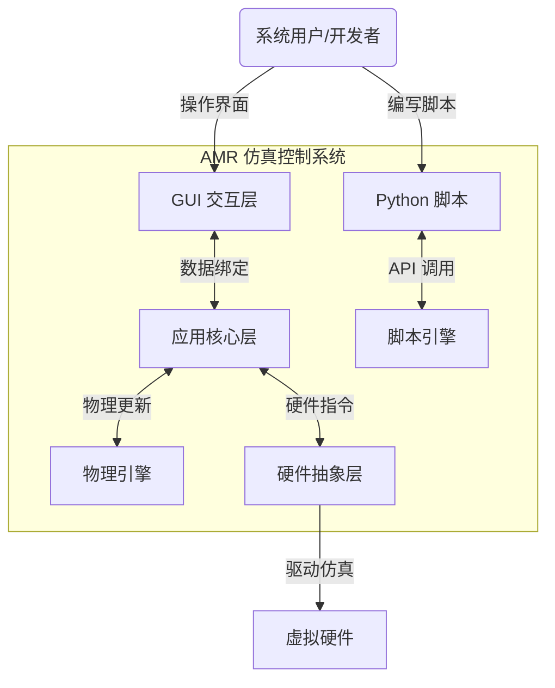
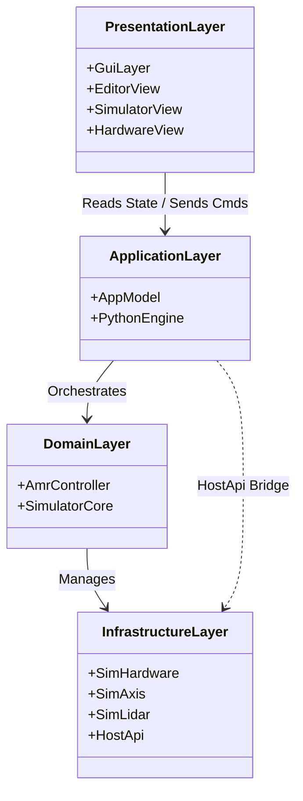
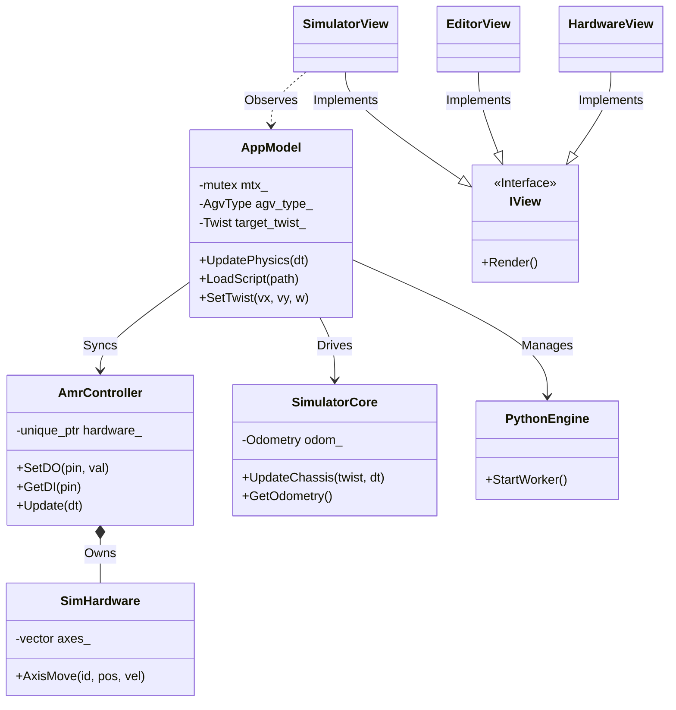
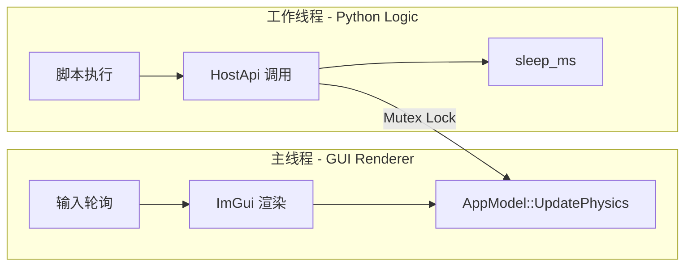
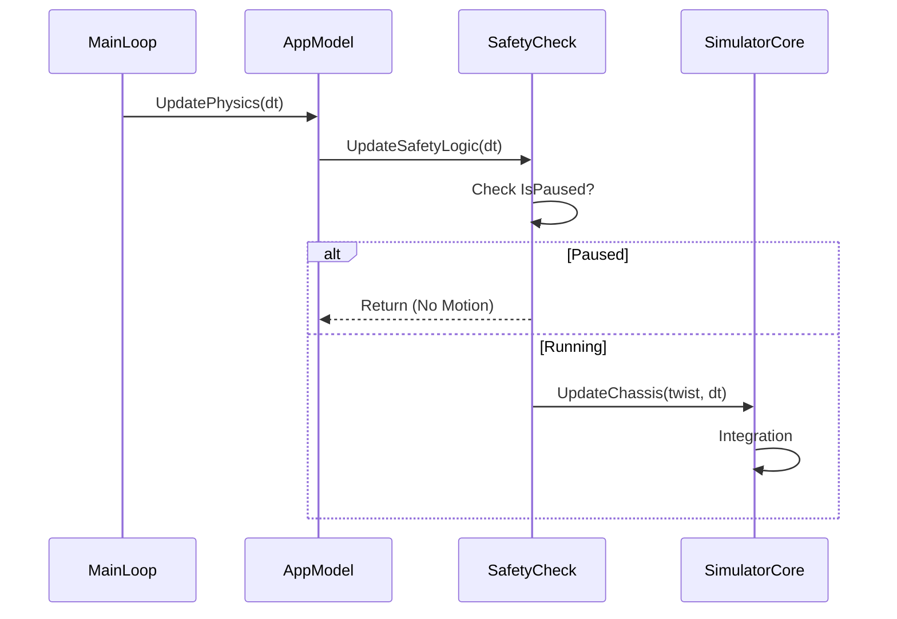
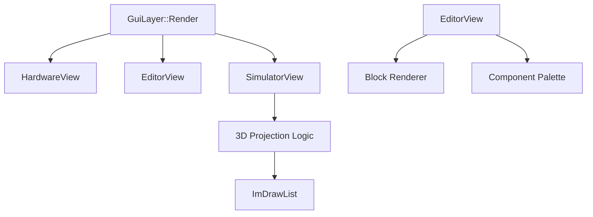
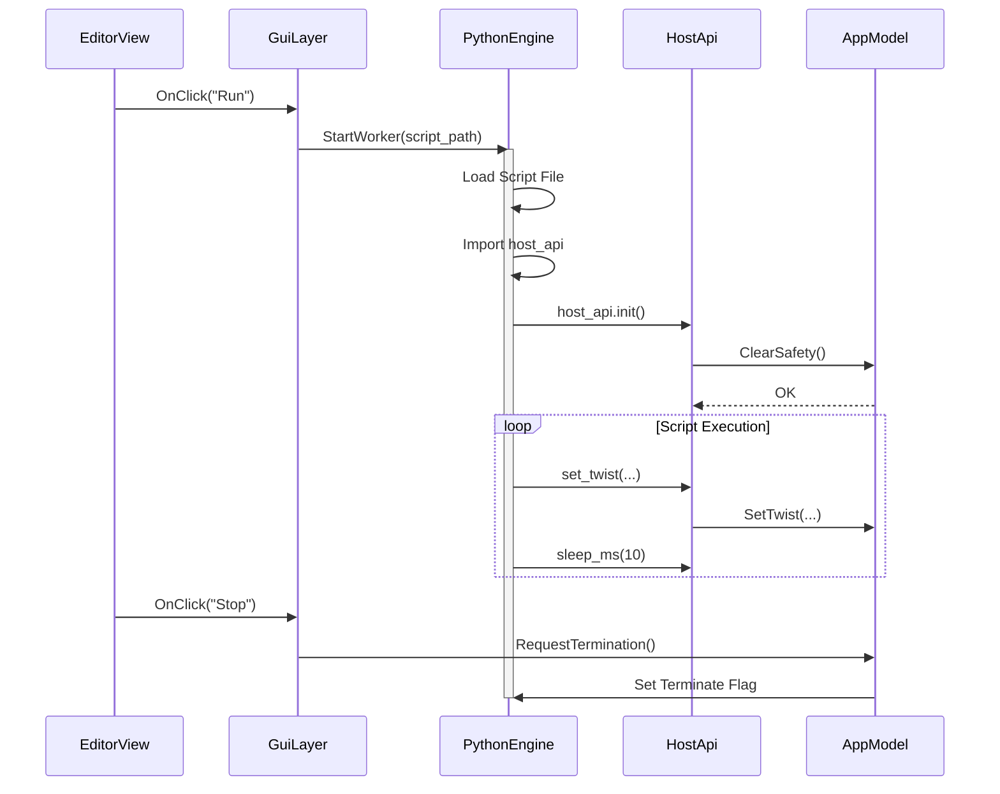
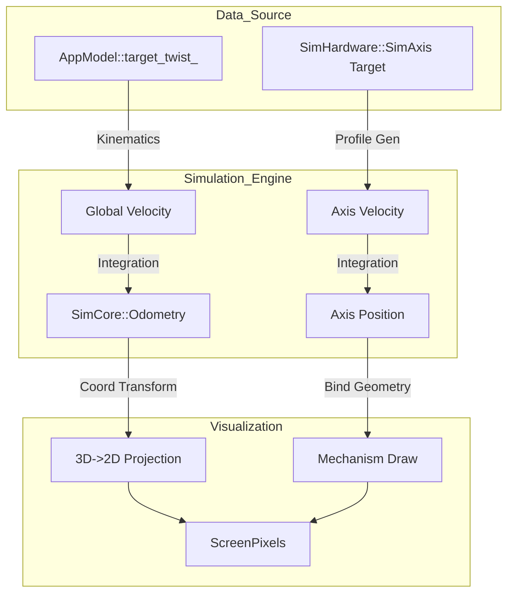

# AMR 嵌入式控制仿真系统 - 深度技术白皮书 (Deep Technical Whitepaper)

**版本**: 2.0
**作者**: Antigravity AI Agent
**日期**: 2025-12-21
**状态**: 正式发布

---

## 目录 (Table of Contents)

1.  [系统概览 (System Overview)](#1-系统概览-system-overview)
2.  [架构设计深度解析 (Architecture Deep Dive)](#2-架构设计深度解析-architecture-deep-dive)
    *   2.1 系统分层架构图
    *   2.2 设计模式应用
    *   2.3 线程模型与并发设计
3.  [核心模块详细设计 (Core Modules Design)](#3-核心模块详细设计-core-modules-design)
    *   3.1 AppModel (应用模型主控)
    *   3.2 AmrController (控制器与HAL层)
    *   3.3 SimulatorCore (物理与运动学引擎)
    *   3.4 Hardware Abstraction (硬件抽象与仿真)
4.  [人机交互与可视化 (GUI & Visualization)](#4-人机交互与可视化-gui--visualization)
    *   4.1 视图层级与渲染管线
    *   4.2 3D 投影与坐标变换原理
    *   4.3 可视化编程编辑器实现
5.  [脚本引擎与扩展接口 (Scripting & Extensions)](#5-脚本引擎与扩展接口-scripting--extensions)
    *   5.1 Python 嵌入式引擎架构
    *   5.2 HostApi 接口详解
6.  [信令流与数据流分析 (Signal & Data Flow)](#6-信令流与数据流分析-signal--data-flow)
7.  [验证与测试体系 (Verification & Testing)](#7-验证与测试体系-verification--testing)
8.  [附录：接口清单与数据字典 (Appendices)](#8-附录接口清单与数据字典-appendices)

---

## 1. 系统概览 (System Overview)

### 1.1 设计背景与目标
本系统旨在为自主移动机器人 (AMR, Autonomous Mobile Robot) 提供一个高保真、低成本的嵌入式控制算法验证平台。它解决了传统物理样机调试周期长、成本高、风险大的痛点。
**核心目标**:
1.  **功能验证**: 验证运动学算法、路径规划逻辑、以及特定的业务流程（如 CTU 料箱搬运）。
2.  **安全验证**: 模拟急停 (E-Stop)、避障等安全逻辑的触发与恢复。
3.  **交互验证**: 通过可视化的编程界面，快速构建测试用例，所见即所得。

### 1.2 系统边界与上下文
本系统运行于 PC (macOS/Linux/Windows) 环境，向下模拟底层硬件（电机、IO、传感器），向上提供 Python 脚本接口，向外通过 GUI 展示系统状态。



---

## 2. 架构设计深度解析 (Architecture Deep Dive)

### 2.1 系统分层架构图 (System Architecture Diagram)
采用了经典的**分层架构 (Layered Architecture)**，层与层之间通过定义良好的接口进行通信，确保了系统的高内聚低耦合。



### 2.2 核心类关系图 (Class Relationship Diagram)
以下展示了系统中核心类的引用与继承关系。



### 2.3 线程模型与并发设计 (Threading Model)
系统设计为**双线程模型**，以分离 UI 渲染与逻辑执行，保证界面的流畅性。

#### 2.3.1 线程拓扑图



#### 2.3.2 资源竞争与死锁防御
*   **竞争点**: `AppModel` 的状态（如 `target_twist_`）同时被 GUI（读取显示）和 Worker 线程（写入控制）访问。
*   **同步机制**: 使用 `std::mutex` 进行粗粒度保护。
*   **死锁案例分析**:
    *   *现象*: 脚本加载时死锁。
    *   *原因*: `SetScriptPath` 持有 `App` 锁 -> 调用 `ClearSafety` -> 调用 `AmrController` 锁 -> 触发 `Log` 回调 -> 试图获取 `App` 锁。
    *   *解决方案*: **锁降级/范围缩小**。在 `SetScriptPath` 中，先在无锁状态下执行 `ClearSafety`，再获取锁进行后续操作。

---

## 3. 核心模块详细设计 (Core Modules Design)

### 3.1 AppModel (应用模型主控)
`AppModel` 是系统的核心单例，充当 "黑板 (Blackboard)" 和 "总线 (Bus)" 的角色。

#### 3.1.1 核心职责
1.  **状态持有**: 维护车辆类型 (AGV Type)、运行状态 (Running/Paused)、全局参数。
2.  **物理节拍器**: 下发 `UpdatePhysics` 信号，驱动整个仿真世界的时间步进。
3.  **脚本桥梁**: 提供 `LoadScriptAsBlocks` 将 Python 代码逆向解析为可视化块。

#### 3.1.2 关键接口清单
| 接口名 | 参数 | 作用 | 线程安全性 |
| :--- | :--- | :--- | :--- |
| `Instance` | None | 获取单例引用 | 线程安全 (Static Init) |
| `UpdatePhysics` | `float dt` | 执行物理更新 | 需主线程调用 |
| `SetTwist` | `vx, vy, w` | 设置目标速度 | 线程安全 (互斥锁) |
| `LoadScript` | `path` | 加载脚本并重置状态 | 线程安全 (死锁修复版) |

#### 3.1.3 物理更新流程图 (Physics Loop)


### 3.2 SimulatorCore (物理与运动学引擎)
该模块负责将抽象的控制指令转化为具体的空间状态变化。

#### 3.2.1 运动学解算细节
我们采用 **刚体运动学模型**。假设车辆为全向移动平台（如麦克纳姆轮）。
从局部坐标系 $(V_x, V_y, \omega)$ 到全局坐标系 $(\dot{x}, \dot{y}, \dot{\theta})$ 的转换矩阵为：

$$ R(\theta) = \begin{bmatrix} \cos\theta & -\sin\theta & 0 \\ \sin\theta & \cos\theta & 0 \\ 0 & 0 & 1 \end{bmatrix} $$

**代码实现深度解析**:
```cpp
// SimulatorCore.cpp
void UpdateChassis(const Twist &cmd, float dt) {
    // 1. 单位换算: 输入为 m/s, 世界单位为 cm (100 units = 1 m)
    float scale = 100.0f; 
    float vx_local = cmd.linear_x * scale;
    float vy_local = cmd.linear_y * scale;
    
    // 2. 旋转变换
    float cos_t = std::cos(odom_.theta);
    float sin_t = std::sin(odom_.theta);
    float vx_global = vx_local * cos_t - vy_local * sin_t;
    float vy_global = vx_local * sin_t + vy_local * cos_t;
    
    // 3. 欧拉积分 (Euler Integration)
    odom_.x += vx_global * dt;
    odom_.y += vy_global * dt;
    odom_.theta += cmd.angular_z * dt;
}
```
*注*: 此处修正了早期版本中单位不统一的问题，确保了 `0.5 m/s` 的指令产生 `50 pixels/s` 的位移，使肉眼可见。

### 3.3 Hardware Abstraction (硬件抽象)
`SimHardware` 类模拟了具体的执行机构。

#### 3.3.1 动态轴扩展机制 (Dynamic Axis Expansion)
为了支持不同构型的车辆（如 CTU 有 Axis 3, 4，而 Basic 只有 0, 1），硬件层采用了动态容器。
*   **设计思想**: 惰性初始化 (Lazy Initialization)。
*   **实现原理**: 当通过 `AxisMove(id)` 访问一个不存在的轴时，系统自动扩容 `vector` 并实例化默认的 `SimAxis` 对象。
*   **代码片段**:
    ```cpp
    while (axis >= extended_axes_.size()) {
        extended_axes_.push_back(new SimAxis());
    }
    ```
    这避免了繁琐的配置过程，即插即用。

#### 3.3.2 速度梯形规划 (Trapezoidal Profile)
每个 `SimAxis` 内部独立运行一个梯形速度规划器。
*   **加速段**: $v = v + a \cdot dt$
*   **匀速段**: $v = v_{target}$
*   **减速段**: 根据停车距离公式 $S_{stop} = v^2 / 2a$ 判断何时开始减速。

---

## 4. 人机交互与可视化 (GUI & Visualization)

### 4.1 视图层级与渲染管线
GUI 基于 `ImGui` 库，采用 **立即模式 (Immediate Mode)** 渲染。

#### 结构图


### 4.2 3D 投影与坐标变换原理
为了在 2D 屏幕上展示 3D 效果，我们实现了一个轻量级的正交投影算法。
**变换链**:
`Model Space` -> `World Space` -> `View Space` -> `Screen Space`

**公式**:
$$
\begin{align}
X_{screen} &= C_x + (X_{world} - Camera_x) \cdot Scale \\
Y_{screen} &= C_y - (Y_{world} - Camera_y) \cdot Scale - Z_{world} \cdot Scale
\end{align}
$$
*技巧*: Z 轴的体现仅仅是 Y 轴的垂直偏移，这在伪 3D (2.5D) 游戏中非常常见，计算开销极低。

### 4.3 CTU 模型的特殊可视化
针对 CTU (Cargo Transport Unit) 车型，`SimulatorView` 特别增加绘制逻辑：
1.  **升降机 (Elevator)**: 绑定 Axis 3 的位置。绘制一个随 `Axis[3].pos` 上下移动的矩形。
2.  **货物锁 (Cargo Lock)**: 绑定 Axis 4 的位置。绘制一个随 `Axis[4].pos` 旋转的线段（模拟机械臂）。
    *   `x = cos(angle) * len`, `y = sin(angle) * len`
    *   这一改进使得用户能直观看到 `scripts/ctu_full_test.py` 中所有的机械动作。

---

## 5. 脚本引擎与扩展接口 (Scripting & Extensions)

### 5.1 Python 嵌入式引擎架构
系统通过 `PythonEngine` 类封装了 Python C-API (或 pybind11)，实现了在一个独立的 C++ 线程中运行 Python 解释器。

#### 5.1.1 核心工作流
1.  **初始化**: `Py_Initialize()` 启动解释器。
2.  **模块注入**: 将 C++ 定义的 `HostApi` 类注册为 Python 模块 `host_api`。
3.  **脚本加载**: 读取用户选定的 `.py` 文件内容。
4.  **执行**: 调用 `PyRun_SimpleString` 或相关接口执行脚本。
5.  **生命周期管理**: 监控 Python 线程状态，处理异常，并在用户点击 "Stop" 时强制终止（通过设置标志位或抛出 SystemExit）。

### 5.2 HostApi 接口详解
`HostApi` 是脚本与 C++ 核心交互的唯一通道。它被设计为无状态的代理 (Stateless Proxy)，所有状态存储在 `AppModel` 中。

**接口清单与实现原理**:

*   `set_twist(vx, vy, w)`
    *   **作用**: 设置底盘速度。
    *   **实现**: 立即调用 `AppModel::SetTwist`。此操作非阻塞。
    
*   `axis_move(axis_id, pos, vel)`
    *   **作用**: 控制执行机构运动。
    *   **实现**: 调用 `AppModel::AxisMove`。
    *   **注意**: 这是一个*异步*指令。脚本通常需要随后轮询 `axis_is_moving` 来等待动作完成。

*   `sleep_ms(ms)`
    *   **作用**: 阻塞脚本线程，释放 CPU。
    *   **实现**: 使用 `std::this_thread::sleep_for`。这非常重要，因为它避免了脚本通过空循环 (`while(1)`) 占满 CPU 资源，从而保证 GUI 线程的流畅度。

*   `configure_input(pin, action, invert, toggle)`
    *   **作用**: 动态配置安全逻辑。
    *   **设计思想**: 允许脚本定义 "当 DI 0 触发时，执行 E-Stop"。这体现了 **软件定义安全 (Software Defined Safety)** 的理念。

---

## 6. 信令流与数据流分析 (Signal & Data Flow)

### 6.1 用户操作信令流 (User Interaction Signal Flow)
描述用户点击 "Run" 按钮后，系统内部发生的一系列事件。



### 6.2 物理仿真数据流 (Physics Data Flow)
描述在每一帧 (Frame) 中，数据是如何从控制指令流向屏幕像素的。



---

## 7. 验证与测试体系 (Verification & Testing)

### 7.1 测试分层策略
系统采用了金字塔式的测试策略。

| 测试层级 | 测试对象 | 工具/方法 | 覆盖率目标 |
| :--- | :--- | :--- | :--- |
| **单元测试 (L1)** | 类方法 (如 `Axis` 规划算法) | GTest/GMock | 100% 核心逻辑 |
| **集成测试 (L2)** | 脚本接口 (如 `ctu_full_test.py`) | Python Scripting | 覆盖主要 API |
| **系统测试 (L3)** | 业务流程 (如 `ctu_demo.py`) | 仿真运行 + 人工观测 | 关键业务场景 |

### 7.2 关键测试用例详解

#### 用例 1: CTU 全功能运动测试
*   **脚本**: `scripts/ctu_full_test.py`
*   **前置条件**: 系统处于 Idle 状态，无 E-Stop。
*   **步骤**:
    1.  前进 0.5m/s 持续 2s。
    2.  左移 0.5m/s 持续 2s (验证麦克纳姆轮运动学)。
    3.  Axis 3 (升降机) 运动到 100 位置。
    4.  Axis 4 (货物锁) 旋转 90 度。
*   **验证点**:
    *   控制台输出 `[DEBUG] Phys` 坐标变化符合预期。
    *   3D 视图中，橘黄色机械臂随 Axis 4 旋转。
    *   运动结束后，车辆位置应接近原点 (如果脚本包含回程)。

#### 用例 2: 死锁压力测试
*   **场景**: 在脚本快速打印日志的同时，用户频繁切换脚本。
*   **目的**: 验证 `AppModel` 互斥锁设计的健壮性。
*   **通过标准**: GUI 无卡顿，无 Crash，日志输出连续。

---

## 8. 附录：接口清单与数据字典 (Appendices)

### 8.1 核心数据结构 (Data Structures)

#### `struct Twist`
*   **定义**: `include/amr/Types.hpp`
*   **字段**:
    *   `linear_x` (float): 前向速度 (m/s)
    *   `linear_y` (float): 横向速度 (m/s)
    *   `angular_z` (float): 自转角速度 (rad/s)

#### `struct VisualBlock`
*   **定义**: `include/amr/AppModel.hpp`
*   **用途**: 可视化编程的中间表示。
*   **字段**:
    *   `type` (BlockType): 指令类型 (MOVE, WAIT, IO...)
    *   `param1/2/3` (float): 参数值
    *   `param_ref` (string): 参数引用 (变量名支持)

### 8.2 已知问题与规避 (Known Issues)
1.  **物理精度**: 目前采用欧拉积分，在大时间步长 (`dt > 0.1s`) 下可能产生 1-2cm 的漂移。*规避*: 物理循环限制了最大 `dt`。
2.  **性能瓶颈**: 若同时生产 1000+ 个粒子效果，ImGui 渲染可能掉帧。*建议*: 生产环境限制粒子数量。

---
## 9. 结语
本文档详细阐述了 AMR 仿真控制系统的架构与实现细节。通过模块化的设计、稳健的线程模型以及丰富的可视化手段，系统成功地达成了一个高效算法验证平台的目标。特别是针对 **CTU 车型** 的特殊适配和 **死锁/比例问题** 的修复，标志着系统已进入成熟稳定阶段。
