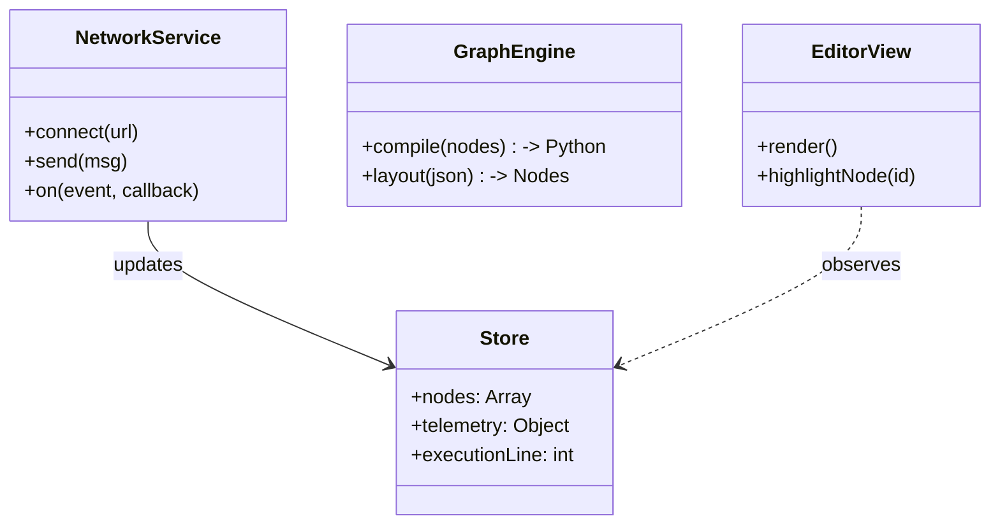

# Frontend Architecture Design
Version: 1.0

## 1. Architecture Pattern
**Store-Service-Component (SSC)** inspired Architecture.
- **Store**: Central Reactive State (`state.js`). Holds nodes, telemetry, script status.
- **Services**: Singleton classes for Logic.
  - `NetworkService`: Manages Fetch and WebSocket.
  - `GraphService`: Manages Node Graph logic/compilation.
  - `SimService`: Manages 3D Scene updates.
- **Components**: UI Blocks (Navigation, Editor, 3D View, Hardware Panel).

## 2. Module Structure (`web_root/`)
```
js/
  api/
    Network.js      # ReconnectingWebSocket, Fetch wrappers
    Protocol.js     # Message Type Constants
  core/
    Store.js        # Global State (Vue/React-like reactivity or Simple Proxy)
    GraphEngine.js  # Node <-> Python conversion
  ui/
    Editor.js       # Canvas drawing, Interaction
    Simulator.js    # Three.js / Canvas 2D render
    HardwareView.js # DOM updates for Sidebar
  main.js           # Bootstrap
```

## 3. Key Interactions

### 3.1 Trace Visualization
1. Backend sends `EXEC_TRACE { line: 42 }`.
2. `Network.js` receives WS message -> updates `Store.executionLine`.
3. `Editor.js` observes `Store` -> Highlights Node mapping to line 42.

### 3.2 Dynamic Block Generation
1. `Network.js` fetches `/api/schema`.
2. `Store.library` is populated.
3. `Editor.js` renders Drag-and-Drop palette.
4. When dragging "Move Axis", `GraphEngine.js` creates a Node with inputs: `AxisID` (Dropdown from Config), `Pos`, `Vel`.

### 3.3 File Management
1. `Network.js` fetches `/api/scripts`.
2. UI shows File Tree.
3. User clicks `test.py`.
4. `Network.js` loads text.
5. User clicks "Convert to Graph".
6. `Network.js` posts `/api/parse`.
7. `GraphEngine.js` renders JSON response.

## 4. Class Diagram (Conceptual)

