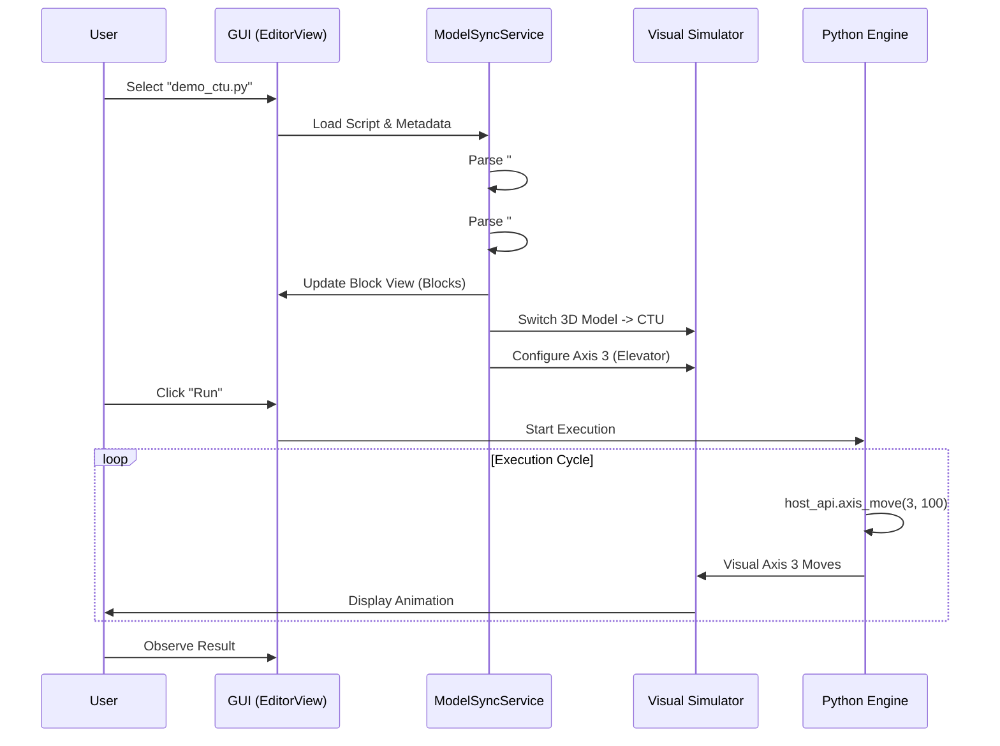
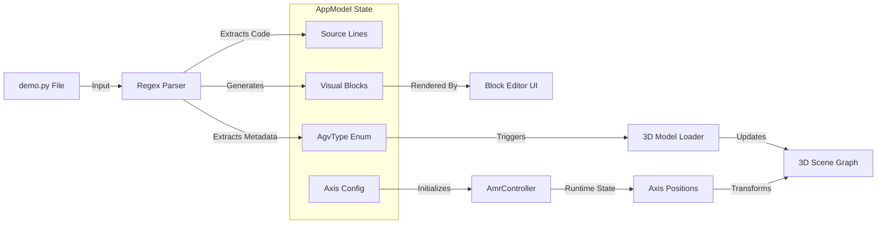
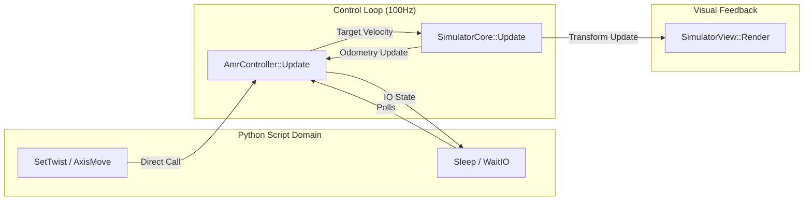

# System Framework Design - Phase 9 (Detailed)

This document provides a comprehensive architectural overview of the AGV Simulation System, focusing on the synchronization between Python scripts, Logical Logic, and 3D Visualization.

## 1. System Architecture Diagram

The system follows a typical MVC (Model-View-Controller) pattern, adapted for Simulation:
- **Model**: `AppModel` (State), `AmrController` (Logic), `SimHardware` (Physics).
- **View**: `EditorView` (Script/Block UI), `SimulatorView` (3D Render), `HardwareView` (IO/Debug).
- **Controller**: `PythonEngine` (Script Execution), `HostApi` (Bridge).

```mermaid
graph TD
    subgraph "User Interface Layer (Views)"
        Editor[EditorView<br/>(Block & Source Editor)]
        SimView[SimulatorView<br/>(3D Rendering & Camera)]
        HardView[HardwareView<br/>(IO & Axis Debug)]
    end

    subgraph "Application Core (Model)"
        App[AppModel<br/>(Singleton State Mediator)]
        Sync[ModelSyncService<br/>(Parser & Config Logic)]
    end

    subgraph "Logic & Control Layer"
        PyEng[PythonEngine<br/>(Execution Thread)]
        AmrCtrl[AmrController<br/>(Safety & Motion Logic)]
        HostAPI[Host API<br/>(Python Bindings)]
    end

    subgraph "Simulation Core"
        SimCore[SimulatorCore<br/>(Physics & Odom)]
        Axes[Virtual Axes]
        Sensors[Virtual Sensors]
    end

    Editor -->|Updates| App
    SimView -->|Reads| App
    HardView -->|Reads/Writes| App
    
    App -->|Manages| AmrCtrl
    App -->|Uses| Sync
    
    PyEng -->|Calls| HostAPI
    HostAPI -->|Mutates| App
    HostAPI -->|Commands| AmrCtrl
    
    AmrCtrl -->|Drives| Axes
    SimCore -->|Updates| Sensors
    Axes -->|Feedback| AmrCtrl
```

## 2. Business Flow Diagram (User Workflow)

Describes the typical user interaction sequence for testing a new process.



## 3. Data Flow Diagram (Sync & Execution)

How data transforms from Disk -> Memory -> Visualization.



## 4. Signal Flow Diagram (Runtime Control)

How real-time signals (Velocity, IO, Events) propagate.



## 5. Relationship Mapping

### 5.1 Script to Model Mapping
The `SyncService` enforces consistency. A script defines the environment it expects:

| User Selection | Script Metadata | Loaded Model | Logical Axes |
| :--- | :--- | :--- | :--- |
| **CTU Demo** | `# model: CTU` | **CTU_MODEL** | 0: Left Wheel<br>1: Right Wheel<br>3: Elevator (Linear)<br>4: Cargo Lock (Rotary) |
| **Forker Demo** | `# model: FORKER` | **FORKER_MODEL** | 0: Left Wheel<br>1: Right Wheel<br>3: Mast (Linear)<br>4: Reach (Linear) |
| **Basic** | `None` | **BASIC_MODEL** | 0: Left Wheel<br>1: Right Wheel |

### 5.2 Interface to Hardware Mapping
The Blocks (UI) equate to specific API calls, which map to Hardware Actions.

- **Block**: `MOVE_AXIS (Axis 3, Pos 100)`
  - **API**: `AmrController::AxisMove(3, 100)`
  - **Hardware**: `SimAxis[3].Target = 100` -> `SimAxis[3].Current += vel * dt`
  - **Visual**: `CTU_Chassis_Mesh` (Static) + `Elevator_Mesh` (Dynamic Z-Offset = Axis 3 Pos)
鼓
